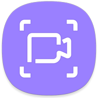
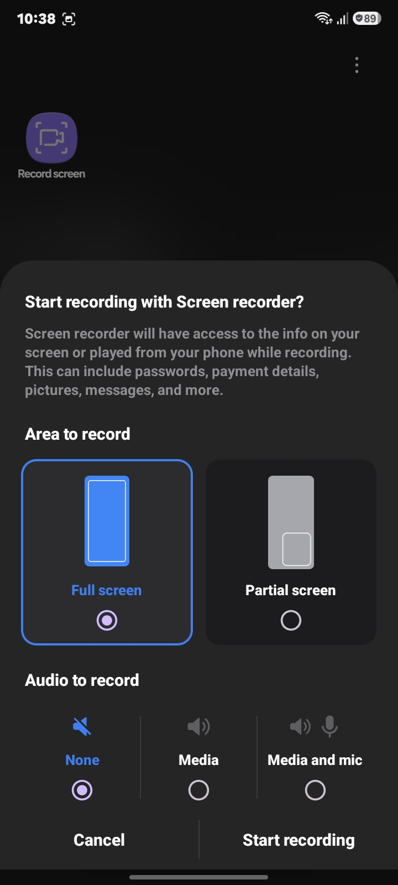
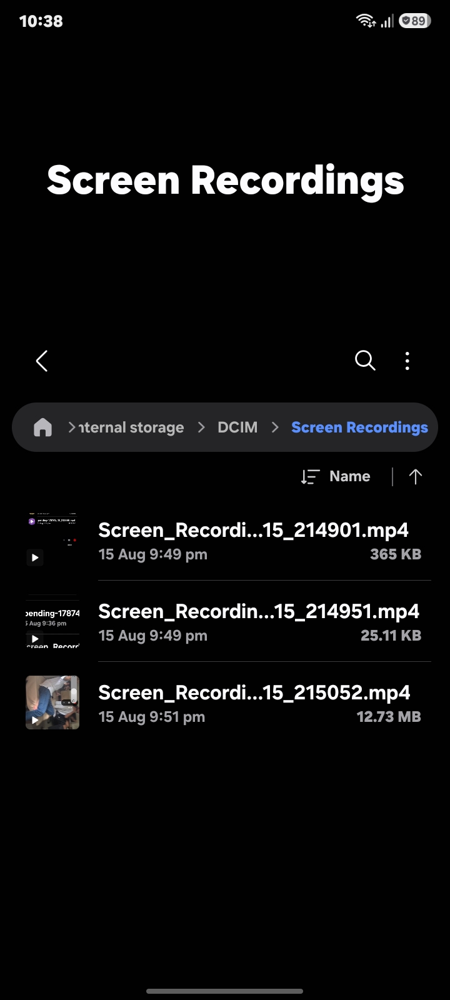
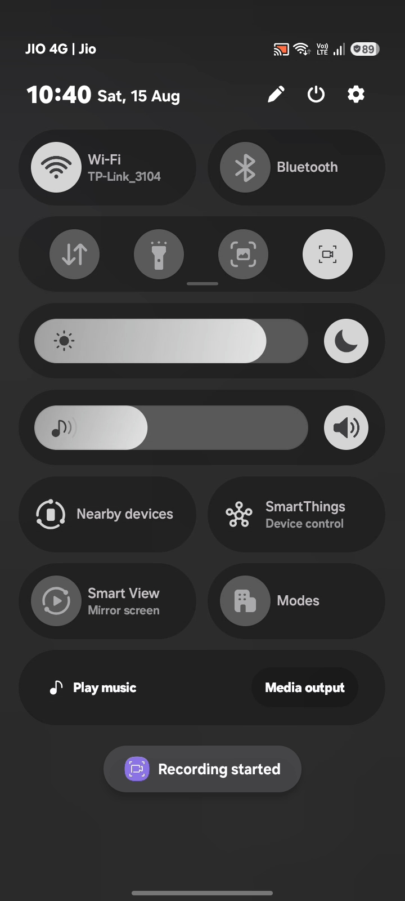
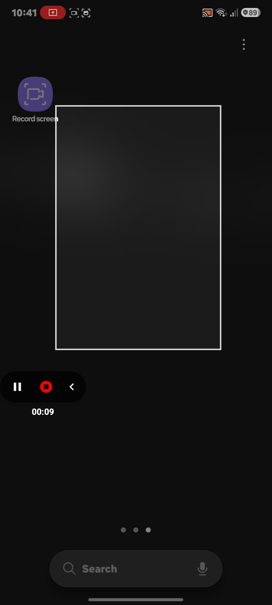

<div align="center">



# Samsung Screen Recorder

**A lightweight, native Android screen recorder built for Samsung devices — clean UI, no bloat, no ads.**

[](https://github.com/YashChaudhari999/samsung-screen-recorder/releases/latest/download/samsung-screen-recorder.apk)
[](LICENSE)
[](#)
[](https://github.com/YashChaudhari999/samsung-screen-recorder/releases)
[](https://github.com/YashChaudhari999/samsung-screen-recorder/stargazers)

[Download](#-download) · [Features](#-features) · [Screenshots](#-screenshots) · [Installation](#-installation) · [Contributing](#-contributing) · [License](#-license)

</div>

---

## 📥 Download

Grab the latest signed APK directly — no Play Store account, no sign-up.

<div align="center">

### [⬇️ Download Latest APK](https://github.com/YashChaudhari999/samsung-screen-recorder/releases/latest/download/samsung-screen-recorder.apk)

*Requires Android 7.0 (Nougat) or higher · ~6 MB · No ads, no trackers*

</div>

> ⚠️ Since this app isn't distributed via the Play Store, you'll need to allow **"Install from unknown sources"** for your browser/file manager. See [Installation](#-installation) below.

---

## ✨ Features

- 🎥 **Native screen recording** using Android's `MediaProjection` API
- 🎨 **One UI–inspired interface** that feels right at home on Samsung devices
- 🎙️ Record with **internal audio, microphone, or both**
- ⏸️ **Pause & resume** recordings on the fly
- 🕒 On-screen countdown before recording starts
- 📁 Auto-saves recordings to a dedicated folder for easy access
- 🌙 Full **dark mode** support
- 🚫 No ads, no unnecessary permissions, no background tracking

---

## 🖼️ Screenshots

| Home | Recording | Quick Settings Tile | Partial Screen Demo |
|:---:|:---:|:---:|:---:|
|  |  |  |  |

---

## 🛠️ Installation

### Option 1 — Download the APK (recommended)

1. Tap the [**Download APK**](https://github.com/YashChaudhari999/samsung-screen-recorder/releases/latest/download/samsung-screen-recorder.apk) button above.
2. Open the downloaded file.
3. If prompted, enable **"Install unknown apps"** for your browser.
4. Follow the on-screen prompts to complete installation.

### Option 2 — Build from source

```bash
# Clone the repository
git clone https://github.com/YashChaudhari999/samsung-screen-recorder.git
cd samsung-screen-recorder

# Build a debug APK
./gradlew assembleDebug

# The APK will be generated at:
# app/build/outputs/apk/debug/app-debug.apk
```

---

## 🧰 Tech Stack

- **Language:** Java
- **Min SDK:** 24 (Android 7.0)
- **Core APIs:** `MediaProjection`, `MediaCodec`, `MediaMuxer`
- **Architecture:** Standard Android (Activities & Services)

---

## 🤝 Contributing

Contributions are what make the open-source community such an amazing place to learn, build, and grow. Any contributions you make are **greatly appreciated** — whether it's fixing a bug, improving documentation, or proposing a new feature.

### Fork and clone the repo

[Fork](https://docs.github.com/en/get-started/quickstart/fork-a-repo) the [repository](https://github.com/YashChaudhari999/samsung-screen-recorder) to your own GitHub account, then [clone](https://docs.github.com/en/repositories/creating-and-managing-repositories/cloning-a-repository) it to your local machine:

```bash
git clone https://github.com/<your-username>/samsung-screen-recorder.git
cd samsung-screen-recorder
```

Add the original repository as an `upstream` remote so you can keep your fork in sync:

```bash
git remote add upstream https://github.com/YashChaudhari999/samsung-screen-recorder.git
```

### Create a new branch

Once you've cloned the repo, create a new branch off `main` for your change. Use a descriptive, kebab-case name that reflects the work:

```bash
git checkout -b feature/pause-resume-recording
```

Some naming conventions to follow:

| Prefix | Use case |
|---|---|
| `feature/` | A new feature or enhancement |
| `fix/` | A bug fix |
| `docs/` | Documentation-only changes |
| `refactor/` | Code changes that don't alter behavior |
| `chore/` | Tooling, CI, or dependency updates |

### Make your changes

- Keep changes focused — one branch, one purpose. Avoid bundling unrelated fixes into a single PR.
- Follow the existing code style (standard [Kotlin coding conventions](https://kotlinlang.org/docs/coding-conventions.html)).
- Add or update comments where logic isn't self-explanatory.
- Test your changes on a real device or emulator before submitting.

### Commit your changes

Write clear, meaningful commit messages. We loosely follow [Conventional Commits](https://www.conventionalcommits.org/):

```bash
git add .
git commit -m "feat: add pause/resume support to recording service"
```

### Push and open a Pull Request

```bash
git push origin feature/pause-resume-recording
```

Then open a pull request against the `main` branch of this repository. A good PR description includes:

- **What** the change does and **why** it's needed
- **How** you tested it (device/emulator, Android version)
- Screenshots or a screen recording, if the change is visual
- A reference to any related issue (e.g. `Closes #12`)

### Before you submit

- [ ] Code builds successfully (`./gradlew assembleDebug`)
- [ ] No unused imports or debug logging left behind
- [ ] UI changes tested on both light and dark mode
- [ ] Commit messages are clear and descriptive
- [ ] PR description explains the change and testing steps

Once submitted, a maintainer will review your PR, may request changes, and will merge it once it's ready. Thanks for contributing! 🎉

---

## 🐛 Reporting Issues

Found a bug or have a feature request? [Open an issue](https://github.com/YashChaudhari999/samsung-screen-recorder/issues/new) and include:

- Device model and Android version
- Steps to reproduce
- Expected vs. actual behavior
- Screenshots/logs if applicable

---

## 📄 License

```text
MIT License

Copyright (c) 2026 Yash Chaudhari

Permission is hereby granted, free of charge, to any person obtaining a copy
of this software and associated documentation files (the "Software"), to deal
in the Software without restriction, including without limitation the rights
to use, copy, modify, merge, publish, distribute, sublicense, and/or sell
copies of the Software, and to permit persons to whom the Software is
furnished to do so, subject to the following conditions:

The above copyright notice and this permission notice shall be included in all
copies or substantial portions of the Software.

THE SOFTWARE IS PROVIDED "AS IS", WITHOUT WARRANTY OF ANY KIND, EXPRESS OR
IMPLIED, INCLUDING BUT NOT LIMITED TO THE WARRANTIES OF MERCHANTABILITY,
FITNESS FOR A PARTICULAR PURPOSE AND NONINFRINGEMENT. IN NO EVENT SHALL THE
AUTHORS OR COPYRIGHT HOLDERS BE LIABLE FOR ANY CLAIM, DAMAGES OR OTHER
LIABILITY, WHETHER IN AN ACTION OF CONTRACT, TORT OR OTHERWISE, ARISING FROM,
OUT OF OR IN CONNECTION WITH THE SOFTWARE OR THE USE OR OTHER DEALINGS IN THE
SOFTWARE.
```
This project is licensed under the **MIT License** — see the [LICENSE](LICENSE) file for details.

---

<div align="center">

Made with ❤️ by [Yash Chaudhari](https://github.com/YashChaudhari999)

If you found this useful, consider giving it a ⭐!

</div>
